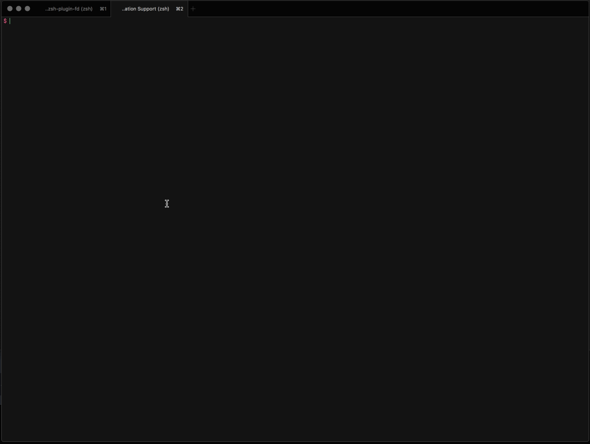

# `fd`

Use `fzf` to browse your directories using fuzzy method.



## Usage

```bash
fd
```

`fd` will look at directories in the current working directory, but if you want to look further, you can supply a depth, e.g.:

```bash
fd 2
```

## Requires

- `fzf`

If you use https://github.com/aubreypwd/zsh-plugin-require, we will try and automatically handle dependancies.

## Install

Using [antigen](https://github.com/zsh-users/antigen):

```bash
antigen bundle aubreypwd/zsh-plugin-fd@1.0.0
```

## Development

Install the package on `master`:

```bash
antigen bundle ssh://git@github.com/aubreypwd/zsh-plugin-fd
```

...and contribute upstream by working in `$HOME/.antigen/bundles/aubreypwd/zsh-plugin-fd`.

---

## Changelog

All changelogs beyond these were moved to Github releases.

### 1.0.1

- Tries to install `fzf` for you if using `antigen` method via `brew`

### 1.0.0

- First version
